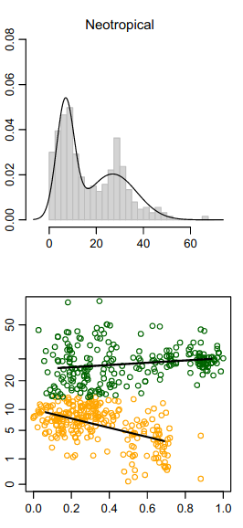
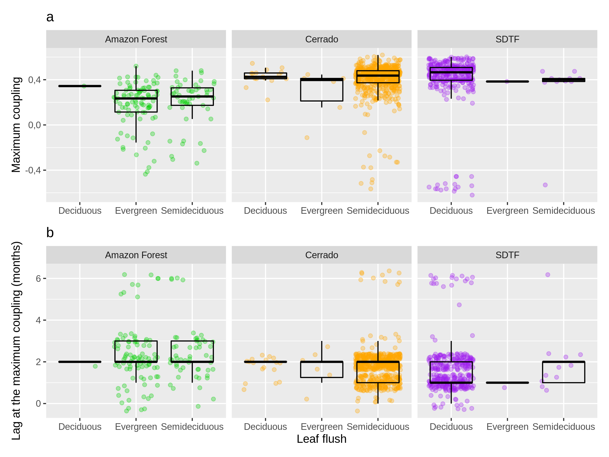
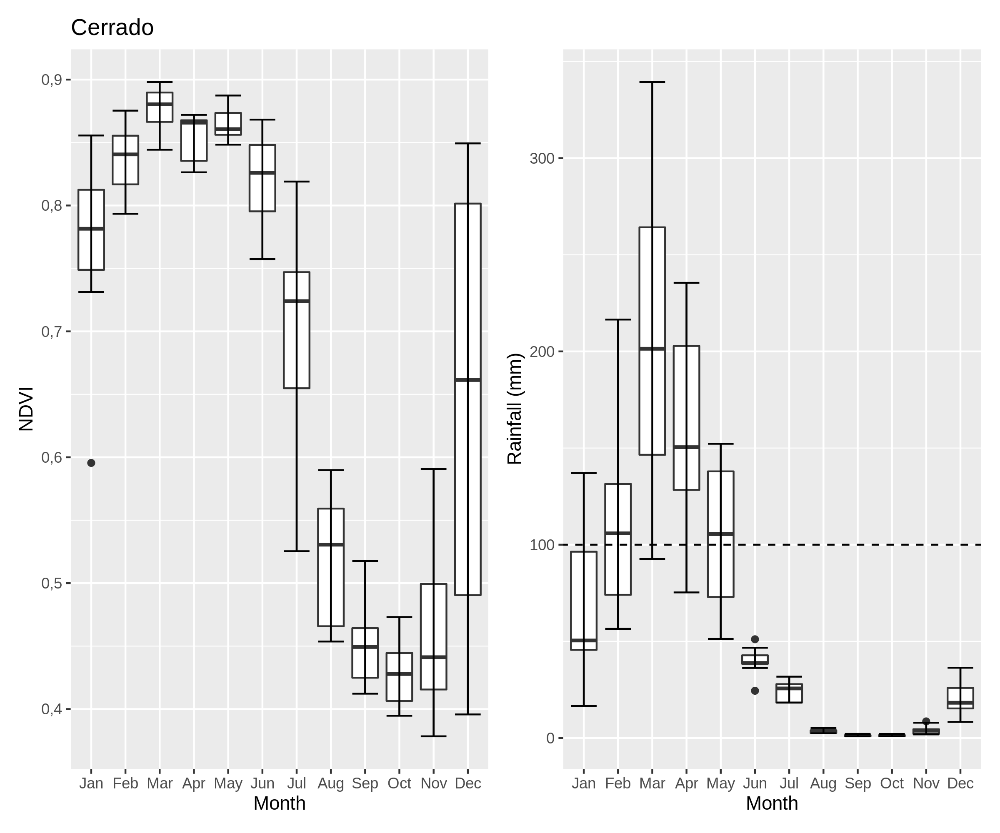
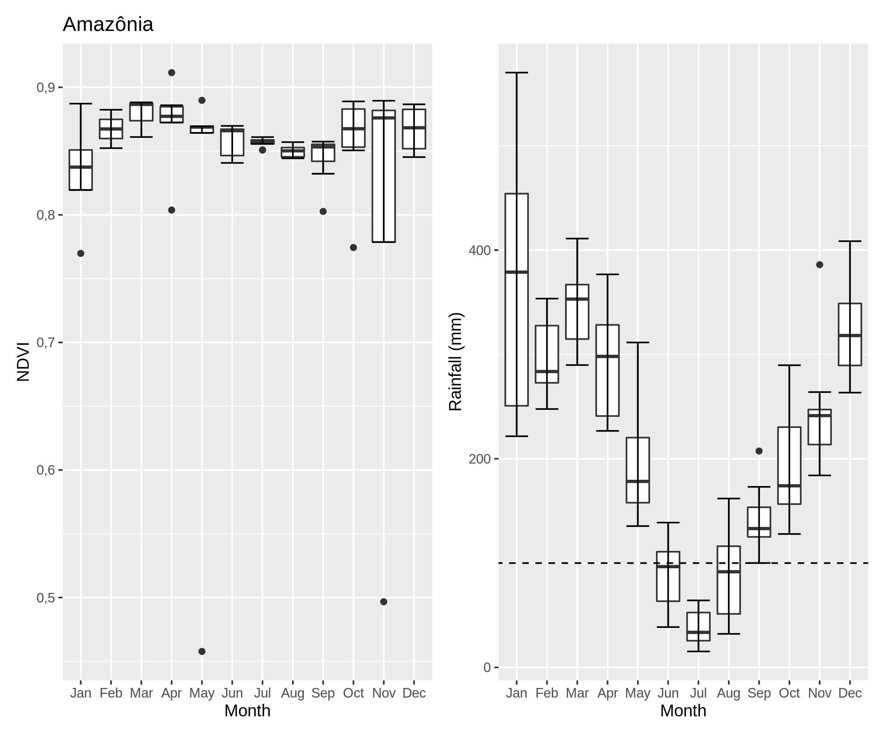

class: top, left

```{r xaringan-logo, echo=FALSE, include=TRUE}
xaringanExtra::use_logo(image_url = "https://ipes.ufsc.br/wp-content/themes/ipes-v1/images/logotipo.png")
```

```{r setup, include=FALSE}
options(htmltools.dir.version = FALSE)
```

```{r webcam, echo=FALSE, include= TRUE}
xaringanExtra::use_webcam()
```

```{r xaringan_themes, echo = FALSE, include=FALSE}
	names(xaringan:::list_css())
```

```{r broadcast, echo=FALSE}
xaringanExtra::use_broadcast()
```

## Savanas e Florestas na região tropical

- São estados alternativos em termos de estrutura da vegetação (cobertura do dossel) determinados parcialmente pela PMA. 

```{r figure1, include=TRUE, echo=FALSE, out.width="60%", fig.align='center', fig.pos='bottom', fig.cap="Hirota et al (2011) Science"}

```


---
# Há diferentes tipos funcionais de Florestas

.center[


*Dexter et al., 2018*
  ]
  

---

class: top, left
# Sob o mesmo regime de precipitação...

- __Savannas__ e __florestas__ dividem a mesma paisagem e sua distribuição é determinada pelo regime de fogo, disponibilidade de água e características do solo.  *Ferreira et al (2007); Dantas et al (2016); Veenendaal et al (2018); Pausas et al (2020); Bernardino et al (2021)*


...que são determinados pelos Feedbacks entre a vegetação e o meio abiótico. (Frequentemente baseado na estrutura da vegetação)

.center[


*Staal & Flores (2015)*
  ]
  
---
class: top, left

# Tentamos diferenciar estes tipos de vegetação funcionalmente

- Produtividade primária como um proxy do funcionamento da vegetação

- Produção primária bruta é uma função básica para os ecossistemas e pode ser inferida por índices derivados de imagens de satélite *Biudes et al (2021)*.

.center[


]

---
# Na escala da paisagem (no Cerrado)

### EVI2 médio não diferencia as florestas

.center[


*Cure et al (Em revisão)*
  ]


---

# O tree cover tb não!


.center[


*Cure et al (Em revisão)*
]


---
# A altura das árvores tb não!

.center[
 

*Cure et al (Em revisão); Xu et al. (2016)*
  ]


---
# A área basal tb não!

.center[


*Cure et al (Em revisão); Dantas et al. (2015)*
  ]

---
# Na mesma paisagem, existe diferença da resposta dessas vegetações às oscilações sazonais da chuva!

.center[


*Cure et al (Em revisão)*
  ]


---
# Na mesma paisagem, existe diferença da resposta dessas vegetações às oscilações sazonais da chuva!

.center[


*Cure et al (Em revisão)*
  ]

---
## O que determina essas respostas?

### Pela heterogeneidade de condições ambientais

.center[


*Cure et al (Em revisão)*
  ]


---
# Em resumo:

.center[


*Cure et al (Em revisão)*  ]


---
## Como diferentes tipos de vegetação respondem à mudanças na chuva nos diferentes Biomas?

- Usei NDVI (baseado no Landsat8) e chuva do Chirps

- Pontos usados no Dexter et al. (2018)

- Correlação de Kendall entre as séries de NDVI e chuva

.center[


*Dados de Dexter et al., 2018*  ]
  
---
# Completei os NAs na série de NDVI

### Qual a melhor abordagem?

.center[

]

---
# Exemplo das séries de chuva e NDVI

.center[

]

---
# Distribuição da resposta

.center[

]
---
# Acoplamento e Lag na maior resposta por Cluster do Dexter

.center[

]
---
# Acoplamento e Lag na maior resposta por Bioma

.center[

]

---
# Resposta em relação ao MAP e CWD


---
# Ciclo anual

### Exemplo: Uma parcela em cada Bioma


.center[



]